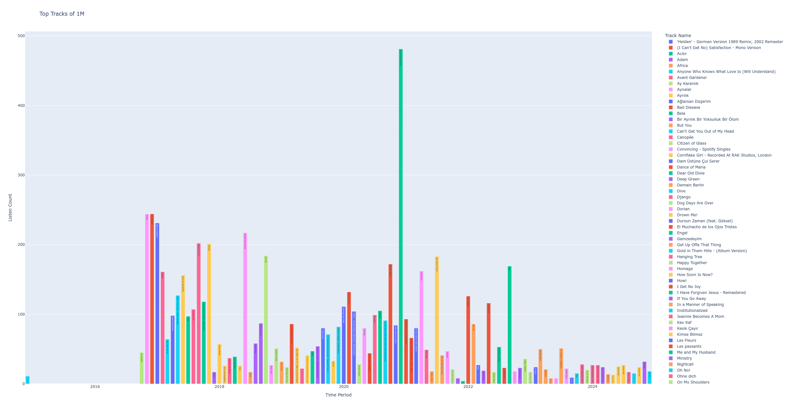
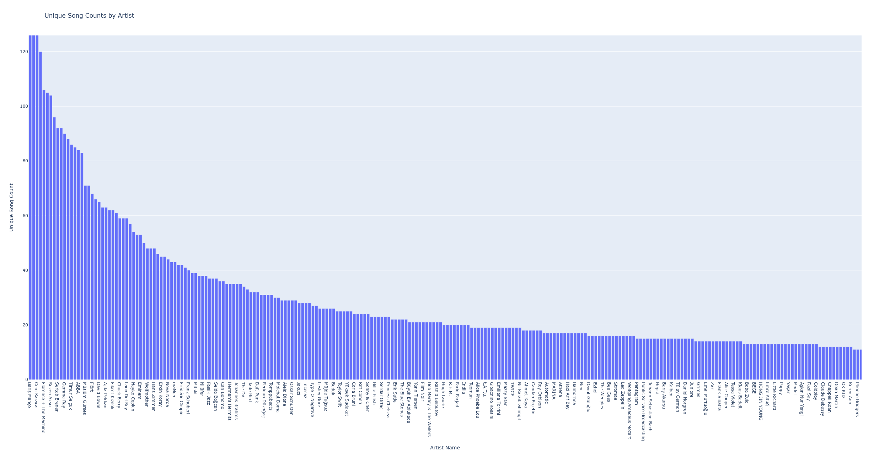

# Analysis of Spotify Extended Streaming History

1. Request your whole streaming history from spotify. (It's prepared and sent to you in a few days.)
2. Place the downloaded zip file in the project directory.
3. Run the `data_preparation.py` to extract, and combine the contents.

## Example Stats

